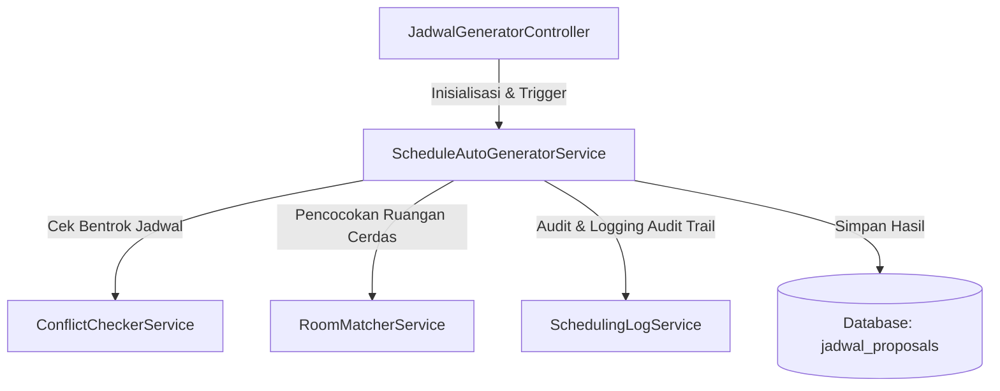
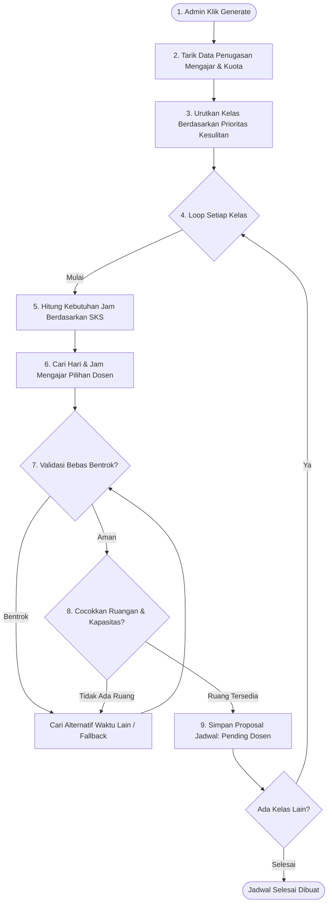

# Dokumentasi Sistem Auto Generate Jadwal
**Universitas Adhyaksa - SATU**

Dokumen ini menjelaskan alur kerja, logika algoritma, prioritisasi, pencocokan ruangan, serta mekanisme pencegahan bentrok (*conflict checking*) pada modul pembuatan jadwal otomatis (*Auto Generate Jadwal*).

---

## 1. Arsitektur & Struktur Kelas

Sistem pembuatan jadwal otomatis diimplementasikan menggunakan arsitektur berlapis (*Service-oriented Architecture*) untuk menjaga kode tetap bersih, modular, dan mudah dipelihara.

### File Utama Terkait:
1.  **Controller:** [JadwalGeneratorController.php](file:///Users/joelnaradata/Project/Universitas%20Adhyaksa%20-%20SATU/app/Http/Controllers/Admin/JadwalGeneratorController.php)
2.  **Service Utama:** [ScheduleAutoGeneratorService.php](file:///Users/joelnaradata/Project/Universitas%20Adhyaksa%20-%20SATU/app/Services/ScheduleAutoGeneratorService.php)
3.  **Conflict Checker:** `App\Services\ConflictCheckerService`
4.  **Room Matcher:** `App\Services\RoomMatcherService`

---

## 2. Alur Kerja Generate Jadwal

Proses pembuatan jadwal otomatis berjalan melalui 6 tahapan utama:

---

## 3. Logika & Aturan Bisnis Utama

### A. Prioritisasi Kelas (Sorting)
Sebelum dimasukkan ke algoritma plotting, kelas-kelas diurutkan berdasarkan tingkat kesulitan penjadwalan (*High Priority First*). Ini mencegah kegagalan plotting untuk kelas yang sulit di akhir proses.
*   **Prioritas 1: Keterbatasan Dosen.** Dosen dengan jumlah slot mengajar paling sedikit dijadwalkan pertama kali.
*   **Prioritas 2: SKS Besar.** Mata kuliah dengan 3-4 SKS dijadwalkan lebih awal karena mencari slot waktu berurutan lebih sulit.
*   **Prioritas 3: Kapasitas Besar.** Mengamankan ruangan berkapasitas besar lebih awal.

### B. Perhitungan Slot Waktu (SKS)
Sistem membagi jam belajar berdasarkan SKS menggunakan konsep *Consecutive Slots* (slot berurutan tanpa jeda):
*   **1 SKS** = 1 slot jam perkuliahan (misalnya 45 menit).
*   **2 SKS** = 2 slot jam berurutan (misal: Jam ke-1 & ke-2: 07:30 - 09:00).
*   **3 SKS** = 3 slot jam berurutan (misal: Jam ke-1, ke-2, & ke-3: 07:30 - 09:45).

### C. Kriteria Deteksi Bentrok (Conflict Checking)
Sebelum jadwal dinyatakan sah, sistem memvalidasi ketersediaan terhadap tiga entitas:
1.  **Dosen:** Dosen tidak boleh mengajar kelas lain di hari dan jam yang sama.
2.  **Ruangan:** Ruangan tidak boleh digunakan oleh kelas lain di hari dan jam yang sama.
3.  **Rombongan Belajar (Kelas/Angkatan):** Mahasiswa di angkatan/kelas yang sama tidak boleh memiliki dua jadwal kuliah yang tumpang tindih.

### D. Pencocokan Ruangan Cerdas (Room Matching)
Sistem mencocokkan ruangan menggunakan kriteria berlapis:
1.  **Kategori Ruangan:** Menyesuaikan jenis mata kuliah (misalnya, mata kuliah teori ke ruang kelas biasa, mata kuliah praktikum peradilan ke ruang peradilan semu).
2.  **Kapasitas Ruangan:** Memastikan daya tampung ruangan mencukupi jumlah mahasiswa (`Kapasitas Ruangan >= Kapasitas Kelas`).
3.  **Algoritma Least Used:** Memilih ruangan yang paling sedikit digunakan untuk menghindari penumpukan kelas di gedung yang sama secara berlebihan.

---

## 4. Siklus Hidup Jadwal (Proposal Lifecycle)

Jadwal hasil generate otomatis tidak langsung aktif, melainkan melewati tahap pengajuan terlebih dahulu untuk menjaga kendali mutu akademik:

| Status Proposal | Deskripsi | Aktor Penentu |
|---|---|---|
| **`pending_dosen`** | Jadwal selesai digenerate oleh sistem, dikirim ke dosen untuk ditinjau. | Dosen |
| **`approved_dosen`** | Dosen menyetujui hari, jam, dan ruangan yang diajukan sistem. | Dosen |
| **`rejected_dosen`** | Dosen menolak jadwal (misal karena ada jadwal lain di luar kampus). | Dosen |
| **`pending_admin`** | Jadwal yang disetujui dosen masuk ke antrean persetujuan admin. | Admin |
| **`approved_admin`** | Admin menyetujui proposal jadwal. Data dipindahkan ke tabel jadwal aktif (`jadwals`). | Admin |
| **`rejected_admin`** | Admin menolak proposal jadwal karena alasan internal fakultas. | Admin |
